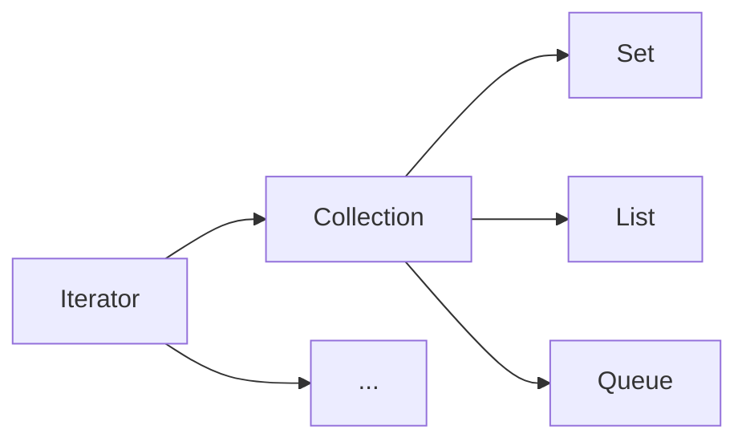

### 背景
collection是Java中非常重要的一个存在，类似一个容器将多个object放入到这个容器，同时也可以以容器为单位进行数据的处理。  
**ps:写作的jdk版本1.8**
<!-- more -->

### 接口关系介绍


Collection的父类接口是Iterator，但是Iterator的子类并不仅仅是Collection。

### Iterator方法介绍
- Iterator.hasNext() 是否还有其他的elements
- Iterator.next()  查询下一个元素，若是没有元素，抛出异常`NoSuchElementException`
- Iterator.remove() 移除
- Iterator.forEachRemaining  

结合代码更加详细的介绍

```java
/**
 * iterator 例子
 *
 * @author yinbingyu
 * @since 2019/07/31
 */
public class IteratorExample {

    public static void main(String[] args) {
        Iterator iterator = Lists.newArrayList("set", "list", "java", "mq").iterator();
        while (iterator.hasNext()) {
            String obj = (String)iterator.next();
            System.out.println(obj);
            if (Objects.equals(obj, "list")) {
                // 移除list元素
                iterator.remove();
            }
        }
    }

}
```
输出的结果  
set  
list  
java  
mq  

Process finished with exit code 0


**1.8之后新增一个新的方法forEachRemaining，其中注意ArrayList的此方法不能使用remove方法**

```java
/**
 * iterator 例子
 *
 * @author yinbingyu
 * @since 2019/07/31
 */
public class IteratorExample {

    public static void main(String[] args) {
        Iterator iterator = Lists.newArrayList("set", "list", "java", "mq").iterator();
        iterator.forEachRemaining(o -> {
            System.out.println(o);
//            if (Objects.equals(o, "list")) {
//              使用remove则会报错java.lang.IllegalStateException
//                iterator.remove();
//            }
        });
    }
}
```
因为ArrayList.remove使用的是lastRet进行判断的，但是ArrayList.forEachRemaining并没有在遍历的时候更新这个字段，而是在所有的遍历结束的时候才会更新

```java
    public void remove() {
        if (lastRet < 0)
            throw new IllegalStateException();
        checkForComodification();
        ......
     }
 
    @Override
    @SuppressWarnings("unchecked")
    public void forEachRemaining(Consumer<? super E> consumer) {
        Objects.requireNonNull(consumer);
        final int size = ArrayList.this.size;
        int i = cursor;
        if (i >= size) {
            return;
        }
        final Object[] elementData = ArrayList.this.elementData;
        if (i >= elementData.length) {
            throw new ConcurrentModificationException();
        }
        while (i != size && modCount == expectedModCount) {
            consumer.accept((E) elementData[i++]);
        }
        // update once at end of iteration to reduce heap write traffic
        cursor = i;
        lastRet = i - 1;
        checkForComodification();
    }

```

### Collection方法
加粗的是since 1.8适用
- int size()  数组的大小
- boolean isEmpty()  判断数字是否为空
- boolean contains(Object o) 数组是否包含某个元素
- Iterator<E> iterator() 返回iterator
- Object[] toArray() 转为数组
- boolean add(E e) 是否添加成功
- boolean remove(Object o) 移除某个元素
- boolean containsAll(Collection<?> c)是否包含全部
- boolean addAll(Collection<? extends E> c)全部添加
- boolean removeAll(Collection<?> c) 移除所有
- **removeIf 自定义移除条件**
- retainAll 移除非集合中的元素
- void clear() 清空集合
- boolean equals(Object o) 比较是否相等
- int hashCode()
- **spliterator() 可分割迭代器**
- **Stream<E> stream() 变成一个流处理**
- **Stream<E> parallelStream() 变成一个平流**

```java
    public static void main(String[] args) {
        List<String> list = Lists.newArrayList("d", "a", "b", "c");
        List<String> retainList = Lists.newArrayList("b","c");
        list.retainAll(retainList);
        // bc
        list.forEach(o-> System.out.println(o));

        List<String> list2 = Lists.newArrayList("d", "a", "b", "c");
        list2.removeIf(o -> o.equals("a"));
        // dbc
        list2.forEach(o-> System.out.println(o));
    }
```


### Collection相关工具类
- java.util.Collections
- com.google.common.collect.Collections2
- org.springframework.util.CollectionUtils
- org.springframework.cglib.core.CollectionUtils
- org.apache.commons.collections.CollectionUtils