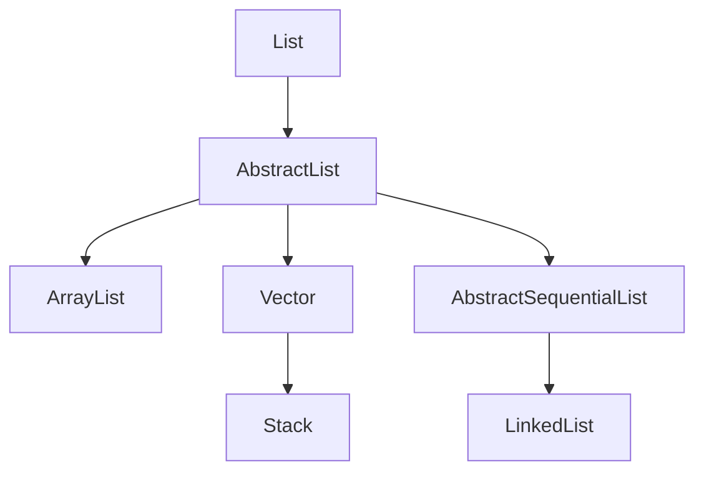

### 简介
List的特点是有序可重复的。底层实现是数组。Guava List的工具类`com.google.common.collect.Lists`
<!-- more -->

### 关系图


### AbstractList
- public boolean add(E e)
- abstract public E get(int index)
- public E set(int index, E element)
- public void add(int index, E element)
- public E remove(int index)
- public int indexOf(Object o)
- public int lastIndexOf(Object o)
- public void clear()
- public boolean addAll(int index, Collection<? extends E> c)
- public Iterator<E> iterator()
- public ListIterator<E> listIterator()
- public ListIterator<E> listIterator(final int index)
- public List<E> subList(int fromIndex, int toIndex)
- public boolean equals(Object o) 
- public int hashCode

### ArrayList
ArrayList是一个线程数据不安全的数组，但是他的查询速度较快,增删较慢

##### 常用的方法
- public ArrayList(int initialCapacity)
- public ArrayList() 没有初始化大小则创建一个空的数据
- public ArrayList(Collection<? extends E> c)
- public int size()
- public boolean isEmpty()
- public boolean contains(Object o)
- public int indexOf(Object o) 多个object的时候，返回第一个查询到的下标
- public int lastIndexOf(Object o)多个object的时候，返回最后一个查询到的下标
- public Object clone() 
- public Object[] toArray()
- public <T> T[] toArray(T[] a)
- E elementData(int index)
- public E get(int index)
- public E set(int index, E element) 替换
- public void add(int index, E element)  
 public boolean addAll(Collection<? extends E> c)  
public boolean addAll(int index, Collection<? extends E> c)
- public boolean add(E e)
- public E remove(int index)
- public boolean remove(Object o) 多个相同的，只删除最先出现的元素  
public boolean removeAll(Collection<?> c)
- public void clear() 只删除元素，并不修改集合的容量
- public boolean retainAll(Collection<?> c)
- public List<E> subList(int fromIndex, int toIndex)
- public void forEach(Consumer<? super E> action)
- public boolean removeIf(Predicate<? super E> filter)
- public void replaceAll(UnaryOperator<E> operator)
-  public void sort(Comparator<? super E> c)
  

##### ArrayList扩容源码

```java
// 添加元素
public boolean add(E e) {
    ensureCapacityInternal(size + 1);  // Increments modCount!!
    elementData[size++] = e;
    return true;
}

private void ensureCapacityInternal(int minCapacity) {
    if (elementData == DEFAULTCAPACITY_EMPTY_ELEMENTDATA) {
        minCapacity = Math.max(DEFAULT_CAPACITY, minCapacity);
    }

    ensureExplicitCapacity(minCapacity);
}

private void ensureExplicitCapacity(int minCapacity) {
    modCount++;

    // overflow-conscious code
    if (minCapacity - elementData.length > 0)
        grow(minCapacity);
}

private void grow(int minCapacity) {
    // overflow-conscious code
    int oldCapacity = elementData.length;
    int newCapacity = oldCapacity + (oldCapacity >> 1);
    // 如果没有指定初始化的集合大小，则将会进入扩容方案newCapacity - minCapacity < 0
    if (newCapacity - minCapacity < 0)
        newCapacity = minCapacity;
    if (newCapacity - MAX_ARRAY_SIZE > 0)
        newCapacity = hugeCapacity(minCapacity);
    // minCapacity is usually close to size, so this is a win:
    elementData = Arrays.copyOf(elementData, newCapacity);
}
```

##### ArrayList 添加元素源码

```java
public boolean add(E e) {
    ensureCapacityInternal(size + 1);  // Increments modCount!!
    // 这个是保证有顺序的地方
    elementData[size++] = e;
    return true;
}
    
public void add(int index, E element) {
    rangeCheckForAdd(index);

    ensureCapacityInternal(size + 1);  // Increments modCount!!
    // 将添加后面的元素进行copy对应的位置
    System.arraycopy(elementData, index, elementData, index + 1,
                     size - index);
    elementData[index] = element;
    size++;
}
```
删除也是和添加类似的处理方式，将删除的元素进行重新的处理。而get则是获取数组下标对应的元素。[System.arraycopyc参考](https://blog.csdn.net/qq_32440951/article/details/78357325)    

### AbstractSequentialList
- public E get(int index)
- public E set(int index, E element)
- public E remove(int index)
- public boolean addAll(int index, Collection<? extends E> c)
- public Iterator<E> iterator()
- public abstract ListIterator<E> listIterator(int index)  
  
    
### LinkedList
LinkedList底层是一个双向链表，它增删快，效率高，但是查询慢，线程不安全

##### 构造参数  
由于它的底层实现是链表，所以没有容量大小的定义，只有上个节点，当前节点，下个节点，每个节点都有一个上级节点和一个下级节点
-  public LinkedList() { }
-  public LinkedList(Collection<? extends E> c) {this(); addAll(c); }


##### 常用方法
- public E getLast()  
  public E getFirst()如果是空集合则报错   public E element()调用的是getFirst  
public E peek()空集合也不会报错，返回null，获取首位数据  
public E peekFirst() 空集合不会报错，返回首位元素  
public E peekLast()空集合不会报错，返回尾部元素
- public E removeFirst()  
  public E remove() 调用上面方法  
  public E removeLast()  
  public boolean remove(Object o)  
  public E remove(int index)
- public void addFirst(E e)  
public void push(E e)调动addFirst  
public boolean offerFirst(E e)调用addFirst   
public void addLast(E e)  
public boolean offerLast(E e)调动上面  
public boolean add(E e)默认是到尾部添加  
public boolean offer(E e)调用上面的方法  
public boolean addAll(Collection<? extends E> c)  
  public boolean addAll(int index, Collection<? extends E> c) 上面的addAll调用这个方法  
  public void add(int index, E element)
- public boolean contains(Object o)  
  public int indexOf(Object o)获取某个元素的下标。contain调用这个方法
- public int size()
- public void clear()
- public E get(int index)
- public E set(int index, E element)
- public int indexOf(Object o)
- public int lastIndexOf(Object o)
- public E poll() 返回首元素，并删除首元素  
public E pop()返回尾部元素，并删除尾部元素调用removeFirst  
public E pollFirst()返回首元素，并删除首元素  
public E pollLast()返回尾部元素，并删除尾部元素  

##### 添加的部分源码解析

```java
// add方法默认的是在尾部进行新增
public boolean add(E e) {
    linkLast(e);
    return true;
}

/**
 * Links e as last element.
 */
void linkLast(E e) {
    final Node<E> l = last;
    final Node<E> newNode = new Node<>(l, e, null);
    last = newNode;
    if (l == null)
        first = newNode;
    else
        l.next = newNode;
    size++;
    modCount++;
}

// Node的结构
private static class Node<E> {
    E item;
    Node<E> next;
    Node<E> prev;

    Node(Node<E> prev, E element, Node<E> next) {
        this.item = element;
        this.next = next;
        this.prev = prev;
    }
}
```
先获取尾部节点元素，判断是否为null，若为null，说明原链表中没有元素，则把 first 和 last 都赋为当前新增节点。若不为null，说明原链表中有元素，则把last赋为当前新增节点，把原节点的prev级节点修改为当前新增节点


```java
// 头部添加
public void addFirst(E e) {
   linkFirst(e);
}

private void linkFirst(E e) {
    final Node<E> f = first;
    final Node<E> newNode = new Node<>(null, e, f);
    first = newNode;
    if (f == null)
        last = newNode;
    else
        f.prev = newNode;
    size++;
    modCount++;
}
```
头部添加类似于尾部添加

```java
// 头部删除
public E removeFirst() {
    final Node<E> f = first;
    if (f == null)
        throw new NoSuchElementException();
    return unlinkFirst(f);
}

private E unlinkFirst(Node<E> f) {
    // assert f == first && f != null;
    final E element = f.item;
    final Node<E> next = f.next;
    f.item = null;
    f.next = null; // help GC
    first = next;
    if (next == null)
        last = null;
    else
        next.prev = null;
    size--;
    modCount++;
    return element;
}
```
如果只有一个元素，那么删除之后first和last都是null，当元素数量大于等于2的时候，删除first之后，将first的next元素置为first，并去掉新first的pre内容

```java

// 尾部删除
public E removeLast() {
    final Node<E> l = last;
    if (l == null)
        throw new NoSuchElementException();
    return unlinkLast(l);
}

private E unlinkLast(Node<E> l) {
    // assert l == last && l != null;
    final E element = l.item;
    final Node<E> prev = l.prev;
    l.item = null;
    l.prev = null; // help GC
    last = prev;
    if (prev == null)
        first = null;
    else
        prev.next = null;
    size--;
    modCount++;
    return element;
}
```
尾部删除类似头部删除，主要复杂的是删除中间的位置，源码如下

```java
public boolean remove(Object o) {
    if (o == null) {
        for (Node<E> x = first; x != null; x = x.next) {
            if (x.item == null) {
                unlink(x);
                return true;
            }
        }
    } else {
        for (Node<E> x = first; x != null; x = x.next) {
            if (o.equals(x.item)) {
                unlink(x);
                return true;
            }
        }
    }
    return false;
}

E unlink(Node<E> x) {
    // assert x != null;
    final E element = x.item;
    final Node<E> next = x.next;
    final Node<E> prev = x.prev;

    if (prev == null) {
        first = next;
    } else {
        prev.next = next;
        x.prev = null;
    }

    if (next == null) {
        last = prev;
    } else {
        next.prev = prev;
        x.next = null;
    }

    x.item = null;
    size--;
    modCount++;
    return element;
}
```
要删除元素的当前节点x，将当前节点x的上级节点的下级节点设为当前节点x的下级节点，将当前节点x的下级节点的上级节点设为当前节点x的上级节点。中间考虑上级节点或下级节点为空的情况，也就是头部删除与尾部删除


##### 查询元素
源码挺简单的，没啥可说的~ 。~
```java
public boolean contains(Object o) {
    return indexOf(o) != -1;
}

public int indexOf(Object o) {
    int index = 0;
    if (o == null) {
        for (Node<E> x = first; x != null; x = x.next) {
            if (x.item == null)
                return index;
            index++;
        }
    } else {
        for (Node<E> x = first; x != null; x = x.next) {
            if (o.equals(x.item))
                return index;
            index++;
        }
    }
    return -1;
}
```  

### Vector
Vector的底层也是通过数组实现的，默认大小也是10。主要特点：查询快，增删慢，线程安全，但是效率低

##### 构造函数
- public Vector(int initialCapacity, int capacityIncrement)
- public Vector(int initialCapacity)
- public Vector()

##### 扩容源码

```java
public synchronized void ensureCapacity(int minCapacity) {
    if (minCapacity > 0) {
        modCount++;
        ensureCapacityHelper(minCapacity);
    }
}

private void ensureCapacityHelper(int minCapacity) {
    // overflow-conscious code
    if (minCapacity - elementData.length > 0)
        grow(minCapacity);
}
    
private void grow(int minCapacity) {
    // overflow-conscious code
    int oldCapacity = elementData.length;
    int newCapacity = oldCapacity + ((capacityIncrement > 0) ?
                                     capacityIncrement : oldCapacity);
    if (newCapacity - minCapacity < 0)
        newCapacity = minCapacity;
    if (newCapacity - MAX_ARRAY_SIZE > 0)
        newCapacity = hugeCapacity(minCapacity);
    elementData = Arrays.copyOf(elementData, newCapacity);
}

private static int hugeCapacity(int minCapacity) {
    if (minCapacity < 0) // overflow
        throw new OutOfMemoryError();
    return (minCapacity > MAX_ARRAY_SIZE) ?
        Integer.MAX_VALUE :
        MAX_ARRAY_SIZE;
}
```
vector的线程安全，主要使用的就是synchronized关键字