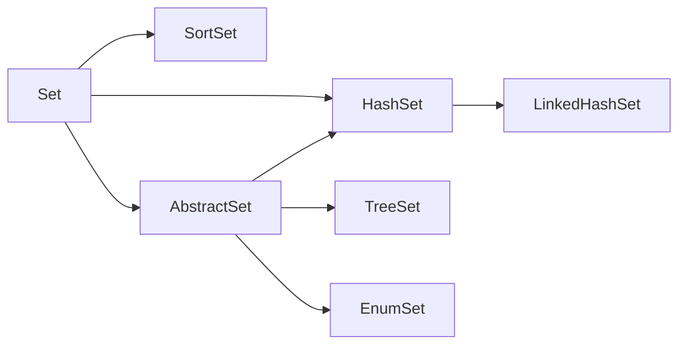

### 简介
Set是一个没有重复数据的集合，Guava Set的工具类com.google.common.collect.Sets
<!-- more -->

### 关系图


### AbstractSet
> AbstractSet extends AbstractCollection implements Set

AbstractSet是所有set实现类的父类。里面是一些set集合常用的基本方法。

- boolean equals(Object o)
- int hashCode()
- boolean removeAll(Collection<?> c)  

父类AbstractCollection
- boolean contains(Object o)
- Object[] toArray() 
- <T> T[] toArray(T[] a) 
-  boolean remove(Object o)
-  boolean containsAll(Collection<?> c)
-  boolean addAll(Collection<? extends E> c)
-  boolean removeAll(Collection<?> c)
-  boolean retainAll(Collection<?> c)
-  void clear() 
-  String toString()

### HashSet
> HashSet的底层是HashMap，使用的Node； 他是一个不重复且无顺序的集合，他的优点就是插入、删除、查询时间复杂度在理想情况下达到O(1)
> HashSet的构造函数使用的皆是HashMap的构造函数，例如： public HashSet() { map = new HashMap<>();}  
> 
HashSet的map处理是值为key，value为PRESENT

 `private static final Object PRESENT = new Object();`
 
-  public Iterator<E> iterator() {
        return map.keySet().iterator();
    }
- public boolean contains(Object o) {
        return map.containsKey(o);
    }
- public boolean add(E e) {
        return map.put(e, PRESENT)==null;
    }
-   public boolean remove(Object o) {
        return map.remove(o)==PRESENT;
    }


```java
/**
 * @author yinbingyu
 * @since 2019/08/05
 */
public class HashSetExample {
     
    public static void main(String[] args) {
        HashSet<String> set2 = Sets.newHashSet();
        set2.add("语文");
        set2.add("数学");
        set2.add("英语");
        set2.add("历史");
        set2.add("政治");
        set2.add("地理");
        set2.add("生物");
        set2.add("语文");
        set2.add("化学");
        System.out.println(JSON.toJSONString(set2));
        System.out.println(set2.contains("生物"));
    }
}
```
`输出结果可知他是一个无序不重复的集合：["政治","生物","历史","数学","化学","语文","英语","地理"]`

HashSet的存储结构是一个链表


HashSet无序是因为HashMap在新增的时候将数组长度-1 和处理后的hash值进行了与操作

```java
final V putVal(int hash, K key, V value, boolean onlyIfAbsent,
                   boolean evict) {
        Node<K,V>[] tab; Node<K,V> p; int n, i;
        if ((tab = table) == null || (n = tab.length) == 0)
            n = (tab = resize()).length;
        if ((p = tab[i = (n - 1) & hash]) == null)
            tab[i] = newNode(hash, key, value, null);
        ......
```

[HashMap底层实现参考](https://www.jianshu.com/p/df4a907ef4ef)

### TreeSet
> TreeSet的底层是TreeMap，他之所以有序使用的是[红黑树](https://mp.weixin.qq.com/s/JBAyti3G3PRYR_T6Y3mcag)。他的特点是有序且唯一。TreeSet的重点是排序，排序方式。排序方式可以在自定义类中实现Comparable接口，或者Comparator。[排序参考](https://www.cnblogs.com/skywang12345/p/3324788.html)


常用的方法:
-   public Iterator<E> descendingIterator() {return m.descendingKeySet().iterator();}
返回TreeSet的逆序排列的迭代器。因为TreeSet时TreeMap实现的，所以这里实际上时返回TreeMap的“键集”对应的迭代器
-   public NavigableSet<E> descendingSet() {return new TreeSet<>(m.descendingMap());} 功能同上
-   public int size() 
-   public boolean isEmpty()
-   public boolean contains(Object o)
-   public boolean add(E e)
-   public boolean remove(Object o)
-   public void clear()
-   public  boolean addAll(Collection<? extends E> c)
-   public NavigableSet<E> subSet(E fromElement, boolean fromInclusive,E toElement, boolean toInclusive) 截取部分集合，两个boolean类型表示是否是包含两端，其中若是toElement不存在则是截取最后一位  
 public SortedSet<E> subSet(E fromElement, E toElement) 调用的是上面的方法，只是默认前闭后开
-   public NavigableSet<E> headSet(E toElement, boolean inclusive)   
public NavigableSet<E> tailSet(E fromElement, boolean inclusive)   一个是从头开始截取，一个是从尾截取  
public SortedSet<E> headSet(E toElement)  
public SortedSet<E> tailSet(E fromElement)
调用的是上面方法，默认前开后闭
- public E first()获取首元素  
  public E last()获取最后一个元素 
- public E lower(E e) 返回Set中小于e的最大元素  
  public E floor(E e) 返回Set中小于/等于e的最大元素  
public E ceiling(E e)返回Set中大于/等于e的最小元素  public E higher(E e)返回Set中大于e的最小元素
- public E pollFirst()获取第一个元素，并将该元素从TreeMap中删除。  
public E pollLast()获取最后一个元素，并将该元素从TreeMap中删除。
- public Object clone()


```java
/**
 * @author yinbingyu
 * @since 2019/08/05
 */
public class TreeSetExample {

    public static void main(String[] args) {

        TreeSet<String> treeSet = Sets.newTreeSet();
        treeSet.add("1语文");
        treeSet.add("3英语");
        treeSet.add("2数学");
        treeSet.add("4政治");
        treeSet.add("5历史");
        treeSet.add("6地理");
        treeSet.add("7生物");
        treeSet.add("8化学");
        System.out.println(JSON.toJSONString(treeSet));
    }
}
```
输出结果：["1语文","2数学","3英语","4政治","5历史","6地理","7生物","8化学"]  

通过断点发现TreeSet在存储数据是 Entry<K,V> e = new Entry<>(key, value, parent);


### LinkedHashSet
> extends HashSet<E> implements Set<E>
> 底层是LinkedHashMap
没有特殊的方法。构造函数调用LinkedHashMap
LinkedHashSet是一个哈希表和链表的结合，且是一个双向链表。   双向链表是链表的一种，他的每个数据节点都有两个指针分别指向直接后继和直接前驱，所以从双向链表的任意一个节点开始都可以很方便的访问它的前驱节点和后继节点。这是双向链表的优点，那么有优点就有缺点，缺点是每个节点都需要保存当前节点的next和prev两个属性，这样才能保证优点。所以需要更多的内存开销，并且删除和添加也会比较费时间。  
> LinedHashSet的顺序是数据录入的顺序，但是TreeSet的顺序是可以自定义排序的顺序，两者是不同的。  

LinkedHashSet的部分源码如下：

```java
final V putVal(int hash, K key, V value, boolean onlyIfAbsent, boolean evict) {
    Node<K,V>[] tab; Node<K,V> p; int n, i;
    if ((tab = table) == null || (n = tab.length) == 0)
        n = (tab = resize()).length;
    if ((p = tab[i = (n - 1) & hash]) == null)
        tab[i] = newNode(hash, key, value, null);
    else {
        ......
    }
}
```
其中Node<K,V> p有两种实现，第一种是HashMap，第二种是LinkedHashMap。LinkedHashSet使用的是第二种，他的方案是总是将新增的元素添加到最后一个位置，并且会记录他的上个元素及其下个元素的信息。

```java
Node<K,V> newNode(int hash, K key, V value, Node<K,V> e) {
    LinkedHashMap.Entry<K,V> p =
        new LinkedHashMap.Entry<K,V>(hash, key, value, e);
    // 将添加的元素添加到最后一位
    linkNodeLast(p);
    return p;
}

private void linkNodeLast(LinkedHashMap.Entry<K,V> p) {
    LinkedHashMap.Entry<K,V> last = tail;
    tail = p;
    if (last == null)
        head = p;
    else {
        p.before = last;
        last.after = p;
    }
}
```
其他的实现基本是和HashSet是一致的